#  GCP Data Engineering Project: Building and Orchestrating an ETL Pipeline for Online Food Delivery Industry with Apache Beam and Apache Airflow

This GCP Data Engineering project focuses on developing a robust ETL (Extract, Transform, Load) pipeline for the online food delivery industry. The pipeline is designed to handle batch transactional data and leverages various Google Cloud Platform (GCP) services:

-  GCS is used to store and manage the transactional data
-  Composer, a managed Apache Airflow service, is utilized to orchestrate Dataflow jobs
-  Dataflow, based on Apache Beam, is responsible for data processing, transformation, and loading into BigQuery
-  BigQuery serves as a serverless data warehouse
-  Looker, a business intelligence and analytics platform, is employed to generate daily reports

These technologies work together to efficiently process, store, and generate reports on the daily transaction data.

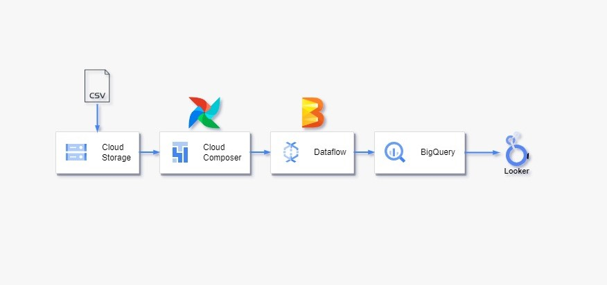

#  GCS

Upload the provided CSV file to your designated Google Cloud Storage (GCS) bucket. This transactional data represents a sample of real-world cases from the online food delivery industry. It includes information such as customer ID, date, time, order ID, items ordered, transaction amount, payment mode, restaurant name, order status, customer ratings, and feedback. The data showcases various scenarios, including late delivery, stale food, and complicated ordering procedures, providing valuable insights into different aspects of the customer experience.

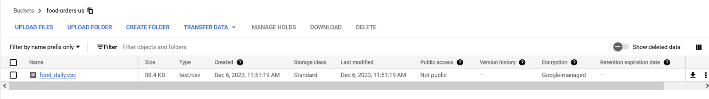

#  Beam code

📖

`beam.py` code is a data processing pipeline implemented using Apache Beam. It reads data from an input file, performs cleaning and filtering operations, and writes the results to two separate BigQuery tables based on specific conditions.

The pipeline consists of the following steps:

1. Command-line arguments are parsed to specify the input file.
2. The data is read from the input file and undergoes cleaning operations, such as removing trailing colons and special characters.
3. The cleaned data is split into two branches based on the status of the orders: delivered and undelivered.
4. The total count of records, delivered orders count, and undelivered orders count are computed and printed.
5. The cleaned and filtered data from the delivered orders branch is transformed into JSON format and written to a BigQuery table.
6. Similarly, the cleaned and filtered data from the undelivered orders branch is transformed into JSON format and written to another BigQuery table.
7. The pipeline is executed, and the success or failure status is printed.

👩‍💻

Set the project in the cloud shell: `gcloud config set project your-project-id`

Install Apache Beam in the cloud shell: `pip install apache-beam[gcp]`

Give the Beam code a test run in the shell and then check the results in BigQuery:  `python beam.py --input gs://your-bucket/food_daily.csv --temp_location gs://your-bucket`

❗  Make sure that all your files and services are in the same location. E.g. both buckets should be in the same location or you will get a similar error message: 'Cannot read and write in different locations: source: US, destination: EU'

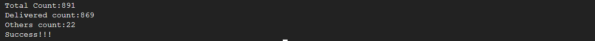

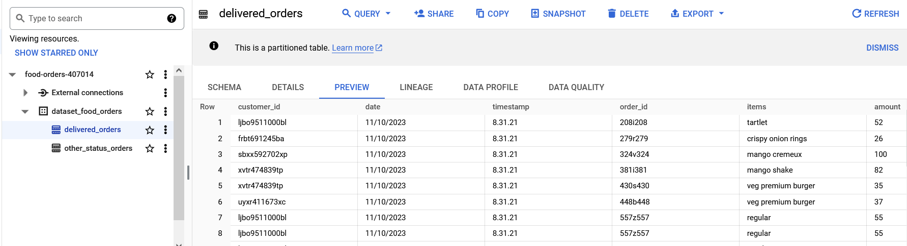

To avoid any confusion, it is recommended to delete the dataset before moving forward with actions that involve appending data in BigQuery.

#  Composer/Airflow

📖

The DAG monitors the GCS bucket for new files with the specified prefix using the GoogleCloudStoragePrefixSensor (for Airflow 1) or GCSObjectsWithPrefixExistenceSensor (for Airflow 2). When a new file is found, it executes the `list_files` function which uses the GoogleCloudStorageHook (for Airflow 1) and GCSHook (for Airflow 2) to move the file to a 'processed' subdirectory and delete the original file. Finally, it triggers the execution of a Dataflow pipeline using the DataFlowPythonOperator (for Airflow 1) or DataflowCreatePythonJobOperator/BeamRunPythonPipelineOperator (for Airflow 2) with the processed file as input.

This setup is ideal for recurring data processing workflows where files arrive in a GCS bucket at regular intervals (e.g., every 10 minutes) and need to be transformed using Dataflow and loaded into BigQuery. By using Apache Airflow and this DAG, you can automate and schedule the data processing workflow. The DAG ensures that the tasks are executed in the defined order and at the specified intervals.

Do note that the actual operator and hook names, and some of their parameters, will differ between Airflow 1 and Airflow 2. Be sure to use the correct names and parameters for your version of Airflow. For example, if your code contains `contrib` imports, it can only be run in Composer 1.

For more information about Airflow operators, please refer to the official Apache Airflow documentation at https://airflow.apache.org/ or the Astronomer Registry at https://registry.astronomer.io/. Additionally, if you have any specific questions or need further guidance, you can interact with "Ask Astro" an LLM-powered chatbot, available at https://ask.astronomer.io.

👩‍💻

Enable Cloud Composer API, Dataflow API: `gcloud services enable composer.googleapis.com dataflow.googleapis.com`

## 🌠Composer 1

[DataFlowPythonOperator](https://airflow.apache.org/docs/apache-airflow/1.10.5/_api/airflow/contrib/operators/dataflow_operator/index.html#airflow.contrib.operators.dataflow_operator.DataFlowPythonOperator) can be used to launch Dataflow jobs written in Python.

To proceed, create a Composer 1 environment.

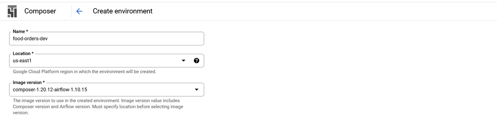

 - Select n1-standard-1 (1 vCPU, 3.75 GB RAM)

 - Disk size: 30. The disk size in GB used for node VMs. Minimum is 30 GB. If unspecified, defaults to 100 GB. Cannot be updated.

 - The Google Cloud Platform Service Account to be used by the node VMs. If a service account is not specified, the "default" Compute Engine service account is used. Cannot be updated.

Creating a Composer 1 environment typically takes around 15 minutes. If the creation process fails, you may want to consider trying a different zone.

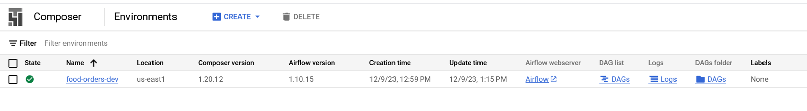

The same `beam.py`, tested in the shell, can be used for both Composer 1 and Composer 2.

Upload the `beam.py` code to the Composer bucket.

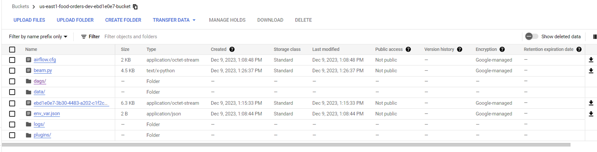

Go to the object details, copy `gsutil URI` and paste it in the DAG file (`py_file`).

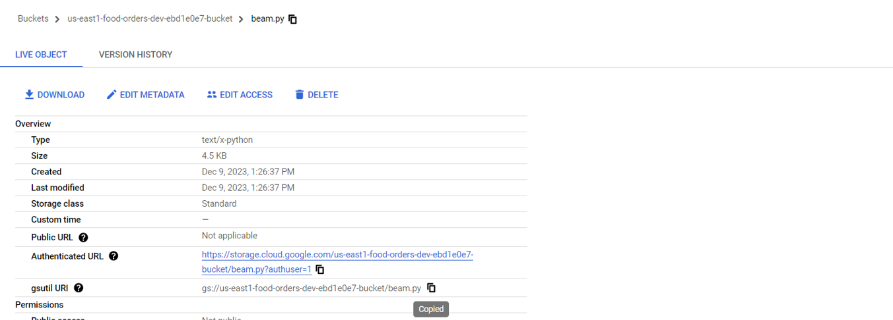

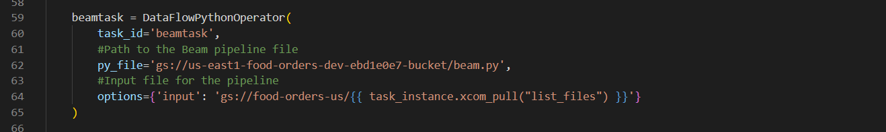

Upload `airflow.py` file to the dags folder.

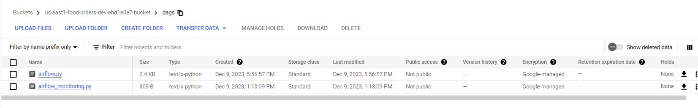

After a few minutes, the DAG will appear in the Airflow UI. For testing purposes, the DAG is initially scheduled to run every 10 minutes. However, you have the flexibility to modify the schedule according to your specific requirements. Wait for the scheduled run to occur automatically or manually trigger the DAG.

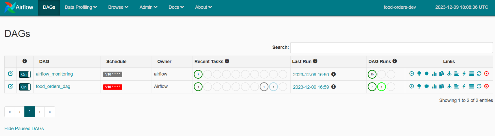

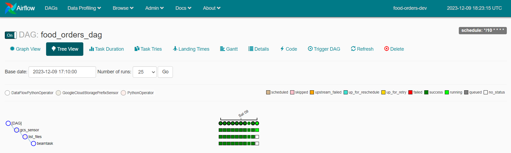

To gain a better understanding of the process, review the logs of each individual task.

### 🚀 gcs_sensor

Sensor checks existence of objects: food-orders-us, food_daily. Success criteria met. Sensor found the file in the bucket.

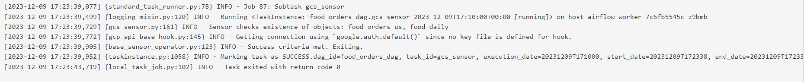

### 🚀 list_files

Object food_daily.csv in bucket food-orders-us copied to object processed/food_daily.csv in bucket food-orders-us. Blob food_daily.csv deleted.

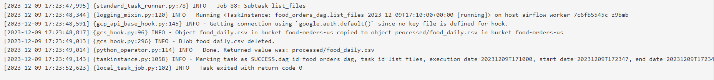

Folder created.

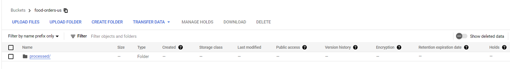

### 🚀 beamtask

The Dataflow job has just started.

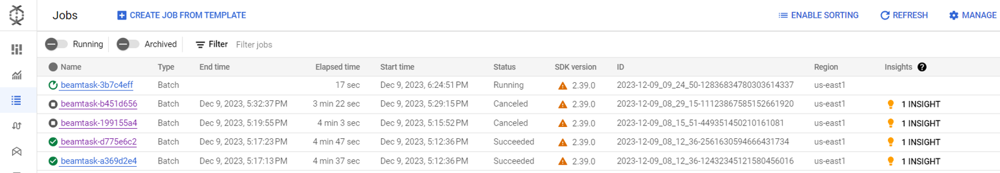

Check the completed tasks in Dataflow.

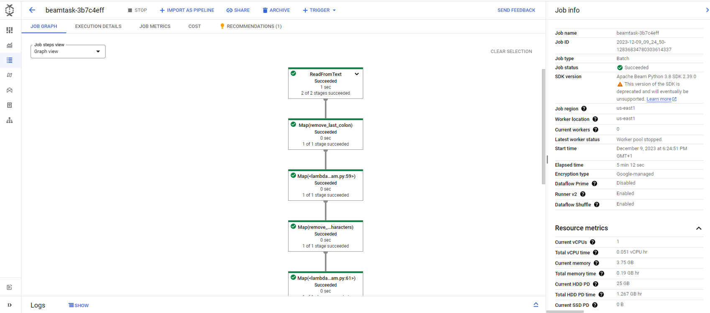

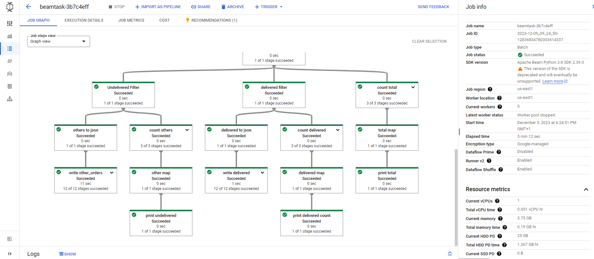

Open BigQuery to see the results.

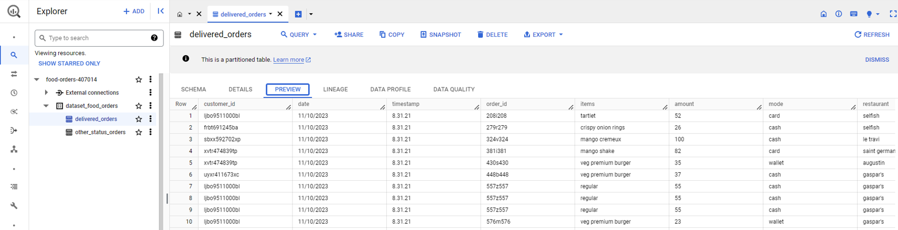

In practice, files often come with timestamps. As a test, I have uploaded a new file to the bucket to verify if the solution is functioning correctly.

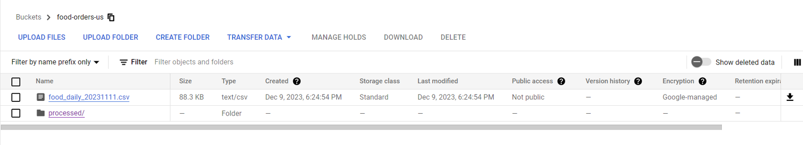

The solution performed as expected. The new file was successfully copied to the 'processed' folder, and the same process was repeated. The resulting transformed data will be appended to the existing tables in BigQuery.

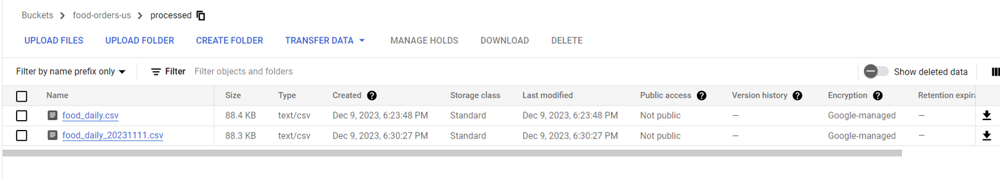

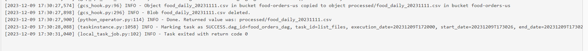

The values can be accessed and retrieved from XComs.

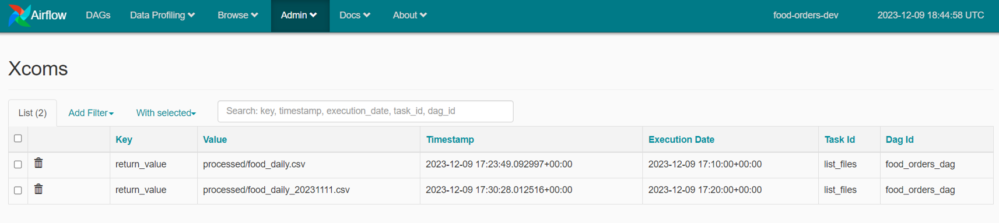

## 🌠Composer 2

Let's move to Composer 2. Create a Composer 2 environment.

The DAGs feature two operators: [DataflowCreatePythonJobOperator](https://airflow.apache.org/docs/apache-airflow-providers-google/stable/_api/airflow/providers/google/cloud/operators/dataflow/index.html#airflow.providers.google.cloud.operators.dataflow.DataflowCreatePythonJobOperator) and [BeamRunPythonPipelineOperator](https://airflow.apache.org/docs/apache-airflow-providers-apache-beam/stable/operators.html#python-pipelines-with-dataflowrunner). While the former is deprecated and no longer actively maintained, it is still available and functional. Although it is recommended to use the Beam operator for improved functionality and ongoing support, you can still try the deprecated operator.

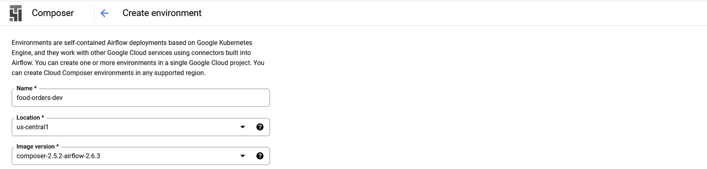

❗ It's important to give `Cloud Composer v2 API Service Agent Extension` role to your Service Account.

Select Environment size: Small.

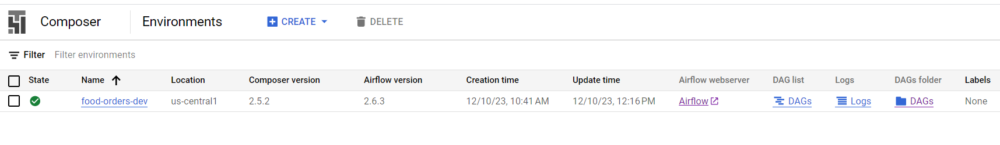

The rest is the same, upload CSV file to the bucket, add Beam code to the Composer bucket, copy `gsutil URl` link and add it to the DAG.

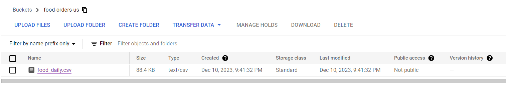

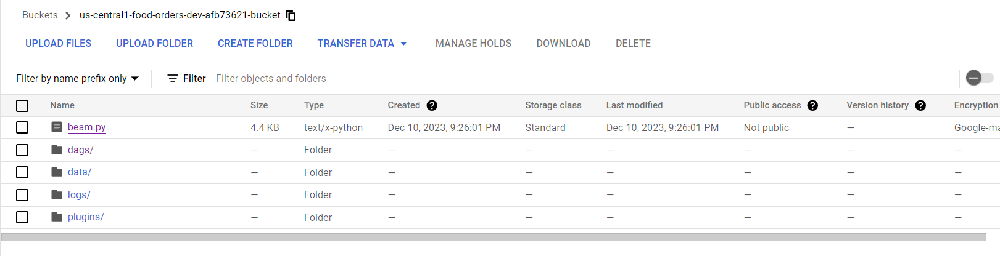

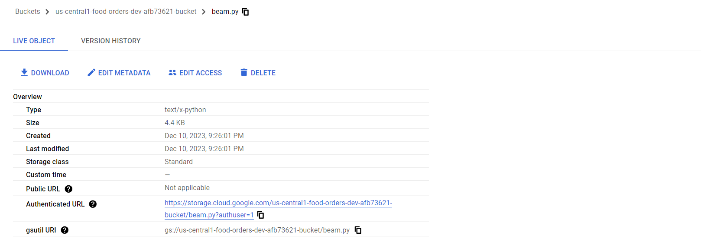

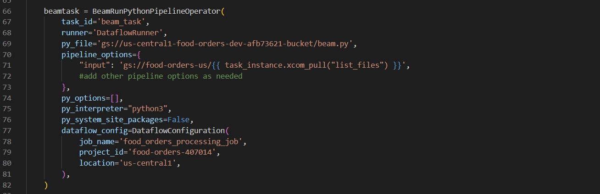

Upload `airflow2.py` code to the dags folder (with DataflowCreatePythonJobOperator or BeamRunPythonPipelineOperator).

Wait for the DAG to appear in the Airflow UI.

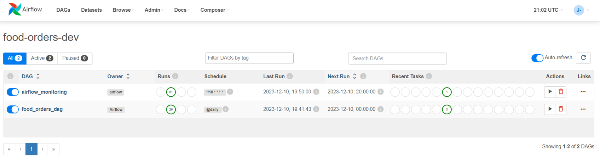

Operators will be visible in the Graph section.

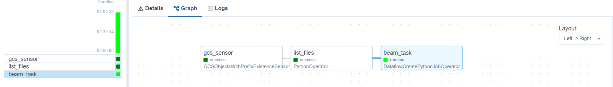

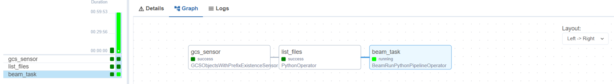

Since it is scheduled to run '@daily' this time, I manually triggered it.

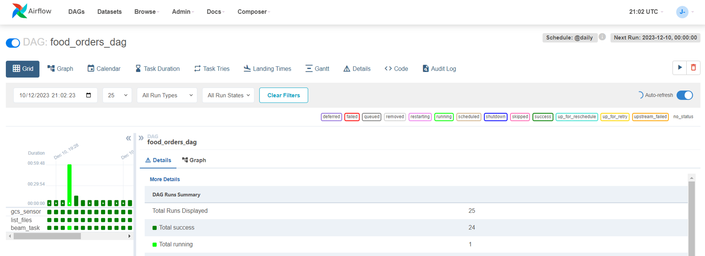

Open Dataflow to check if the job is currently running.

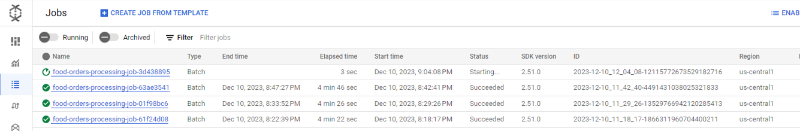

As expected, the Dataflow job will create 2 tables in BigQuery. 👏🎉

❗ Make sure to delete Composer from your setup as it can be a costly service. It's worth mentioning that Google Cloud provides an advantageous [Free Trial](https://cloud.google.com/free/docs/free-cloud-features#free-trial) option. As a new customer, you will receive $300 in free credits, allowing you to thoroughly explore and assess the capabilities of Google Cloud without incurring any additional expenses.

#  Looker

Connect to your Looker account: https://lookerstudio.google.com. Select BQ connection.
Create your own daily report, use delivered/other_status_orders tables. Here is my example

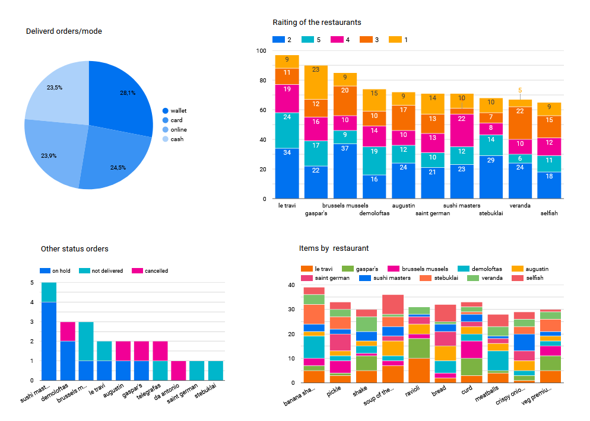
